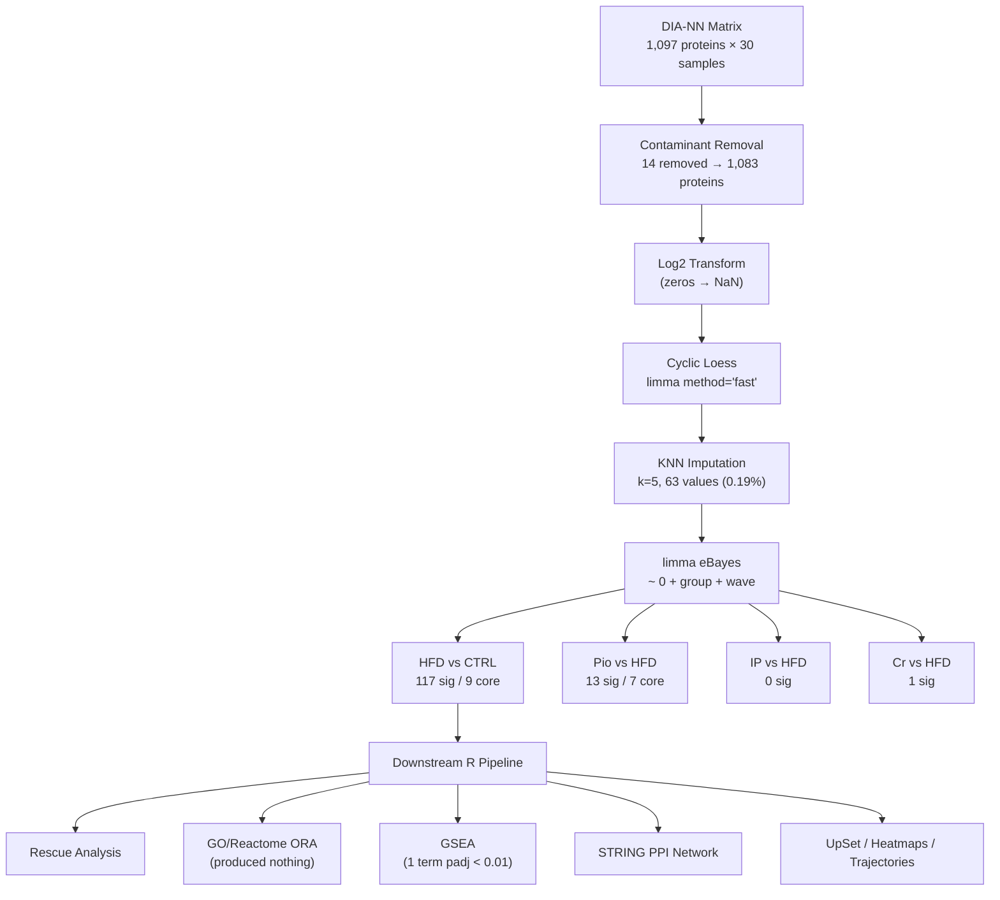

# Critical Review: Rat Hippocampal Proteomics Pipeline

## 1. Pipeline Summary



### Design

- **30 rats**: 5 groups × 6 animals, each with 3 technical replicates
- **Groups**: CTRL, HFD, HFD+Pioglitazone (Pio), HFD+Inorganic Phosphate (IP), HFD+Creatine (Cr)
- **Balanced batch design**: Each group split 3 Wave1 + 3 Wave2 — **verified correct** for all 30 samples

---

## 2. Code Bug Review

### 🔴 BUG 1: Nol3 (Q62881) — Misleading 16-Fold Change (HIGH)

Not a code bug per se, but the pipeline fails to flag an unreliable hit. I examined the raw intensities:

| CTRL Sample | Raw Intensity | Log2 |
|-------------|--------------|------|
| AC1R1 | 685,653 | 19.4 |
| **AC1R2** | **39,347,565** | **25.2** |
| AC1R3 | 288,633 | 18.1 |
| AC2R1 | 915,354 | 19.8 |
| AC2R2 | 890,320 | 19.8 |
| **AC2R3** | **41,938,143** | **25.3** |

4 of 6 CTRL samples have intensities ~300K–900K. The other 2 have ~40M — **a 50–100× within-group difference**. All 6 HFD samples are tightly clustered at ~40M. This protein has zero missing values (0/30), so it's not an imputation artefact.

The reported log2FC of +3.99 is the difference between a bimodal CTRL mean (21.4) and a tight HFD mean (25.4). **This is not a clean biological shift** — it's driven by 4 CTRL outliers.

> [!WARNING]
> Nol3 should be flagged or excluded from headline biological interpretation. The within-CTRL standard deviation (2.88 in log2 space) is ~50% of the reported fold-change.

---

### 🔴 BUG 2: GO and Reactome ORA Silently Produced Nothing (HIGH)

**File**: [downstream_analysis.R](file:///c:/Users/Ibrah/Downloads/prot/downstream_analysis.R) lines 106–119

Both `enrichGO()` and `enrichPathway()` returned zero significant terms. The code wraps output in `if (!is.null(go_res) && nrow(go_res) > 0)` — which silently skips saving when there are no results. **No `go_enrichment.csv`, `go_dotplot.png`, `reactome_enrichment.csv`, or `reactome_dotplot.png` were ever created.** There is no `cat()` or warning message when this happens.

This means an entire section of the downstream analysis (pathway-level enrichment from ORA) produced nothing, and it went completely unreported.

Only the GSEA (with permissive `pvalueCutoff = 1`) returned results. Of those, only **1 term** passes padj < 0.01: "nucleoside phosphate metabolic process."

---

### 🟡 BUG 3: Python Boolean Serialization (MEDIUM)

**Files**: [corrected_de_analysis.py](file:///c:/Users/Ibrah/Downloads/prot/corrected_de_analysis.py) lines 262–263 → [downstream_analysis.R](file:///c:/Users/Ibrah/Downloads/prot/downstream_analysis.R) line 223

Python writes `True`/`False` to CSV. R reads them as character strings. Verified:
- `sum(de$significant_FC1 == "True")` → **9** (works by coincidence)
- `sum(de$significant_FC1 == TRUE)` → **0** (would silently fail)

The trajectory plot at line 223 depends on `filter(significant_FC1 == "True")`. This works today but would break silently if the Python CSV export format ever changes.

---

### 🟡 BUG 4: `col_colors` Variable Scope (MEDIUM)

**File**: [downstream_analysis.R](file:///c:/Users/Ibrah/Downloads/prot/downstream_analysis.R)

`col_colors` is defined at line 206 inside `if (length(union_sig) > 0) { ... }`. The trajectory plot at line 252 uses it outside that conditional. If the conditional didn't execute (no significant proteins), the trajectory code would crash. It worked in our run because we had 130 union-significant proteins.

---

### 🟡 BUG 5: Hemoglobin Not Removed as Contaminant (MEDIUM)

**File**: [corrected_de_analysis.py](file:///c:/Users/Ibrah/Downloads/prot/corrected_de_analysis.py) lines 93–100

The contaminant filter removes keratin, trypsin, and serum albumin, but **not hemoglobin**. Three hemoglobin chains are present in the DE results:

| Protein | log2FC | padj | Description |
|---------|--------|------|-------------|
| P11517 (Hbb-bs) | +1.23 | 0.007 | Hemoglobin subunit beta-2 |
| P02091 (Hbb) | +0.75 | 0.030 | Hemoglobin subunit beta-1 |
| P01946 (Hba1) | +0.77 | 0.079 | Hemoglobin subunit alpha-1/2 |

Hbb-bs is one of the 9 core HFD signature proteins. Whether this represents genuine BBB breakdown or residual blood depends on whether animals were perfused before dissection — **a question for the experimentalist**.

---

### 🟡 BUG 6: UpSet Plot Color Order Not Guaranteed (MEDIUM)

**File**: [downstream_analysis.R](file:///c:/Users/Ibrah/Downloads/prot/downstream_analysis.R) line 134

`sets.bar.color = c("#e74c3c", "#9b59b6", "#f39c12", "#3498db")` — these 4 colors are applied to sets in UpSetR's **internal display order** (by frequency/alphabetical), not the input list order. The color-to-group mapping is coincidental.

---

### 🟢 BUG 7: `generate_qc_figures.py` Dangerous Fallback (LOW)

**File**: [generate_qc_figures.py](file:///c:/Users/Ibrah/Downloads/prot/generate_qc_figures.py) line 59

```python
A = df['AveExpr'] if 'AveExpr' in df.columns else df.mean(axis=1)
```

The fallback `df.mean(axis=1)` would average all columns including non-numeric ones like "Protein" and "Description," producing NaN. Never triggers in practice since limma always outputs `AveExpr`.

---

### 🟢 CONFIRMED CORRECT

- ✅ **Wave assignment** — verified all 30 samples assigned correctly
- ✅ **Design matrix** — cell-means `~ 0 + group + wave`, correct 6-column design, residual df = 24
- ✅ **Contrasts** — `HFD - CTRL`, `HFD_Pio - HFD`, `HFD_IP - HFD`, `HFD_Cr - HFD` all correct
- ✅ **Normalization** — `method="fast"` correctly avoids NA propagation (missingness stays at 0.19%)
- ✅ **eBayes** — `topTable(number=Inf, sort.by="none")` returns all proteins unsorted, correct
- ✅ **No duplicate Entrez IDs** — 957 mapped proteins → 957 unique Entrez IDs (GSEA valid)
- ✅ **Rescue formula** — `-(FC_drug / FC_hfd) * 100` is mathematically correct (positive = reversal toward CTRL)
- ✅ **Very low missingness** — CTRL 0.2%, HFD 0.2%. KNN affected very few values
- ✅ **Rescue scatter plot** — dashed y = −x line is the correct "perfect rescue" reference

---

## 3. The Biological Story

### 3.1 The HFD Insult

HFD perturbs 117/1,083 detectable proteins (10.8%) at FDR < 0.05 — **66 upregulated, 51 downregulated**. Only 9 pass the strict 2-fold threshold, indicating the perturbation is **widespread but moderate**.

#### The 9 Core HFD Proteins

| Protein | Symbol | log2FC | Function | Reliability |
|---------|--------|--------|----------|-------------|
| P48056 | Slc6a12 | +1.47 | Betaine/GABA transporter | ✅ Clean |
| B0K020 | Cisd1 | +1.36 | Mitochondrial iron-sulfur protein | ✅ Clean |
| P28570 | Slc6a8 | +1.34 | Creatine transporter | ✅ Clean |
| P11517 | Hbb-bs | +1.23 | Hemoglobin beta-2 | ⚠️ Blood contam? |
| P27274 | Cd59b | +1.12 | Complement regulator | ✅ Clean |
| P62959 | Hint1 | +1.04 | Purine metabolism | ✅ Clean |
| P08932 | Kng1 | +1.02 | Kininogen (inflammation) | ⚠️ Plasma protein |
| Q62881 | Nol3 | +3.99 | Anti-apoptotic | 🔴 Bimodal CTRL |
| Q64537 | Capns1 | −1.10 | Calpain small subunit | ✅ Clean |

**Biological themes (from reliable hits only):**

1. **Neurotransmitter transport disruption** — Slc6a12 (GABA reuptake) and Slc6a8 (creatine transport) are the two most strongly upregulated proteins. This suggests altered GABAergic signalling and creatine-phosphocreatine energy buffering in hippocampal neurons under HFD.

2. **Mitochondrial/metabolic stress** — Cisd1 (iron-sulfur cluster protein) is upregulated. At the broader FDR < 0.05 threshold, multiple metabolic enzymes trend upward: Cox5a, Ndufs2, Atp5f1d, Aldoa, Ldha — pointing to compensatory energy production.

3. **Blood-brain barrier / vascular involvement** — Hbb-bs, Kng1, and Cd59b all suggest vascular biology. If animals were perfused, these may represent genuine BBB compromise. If not, they may be dissection artefacts. Kng1 (kininogen) is part of the kallikrein-kinin inflammatory cascade.

4. **Impaired calcium-dependent proteolysis** — Capns1 (the sole downregulated core protein) is essential for calpain function, which is critical for synaptic plasticity and long-term potentiation.

### 3.2 The Interventions

#### Pioglitazone: No Rescue + Own Independent Perturbation

| Metric | Value |
|--------|-------|
| Median % rescue of HFD proteins | **−12.3%** |
| HFD proteins worsened by Pio | **72/117 (62%)** |
| Pio's own FDR-significant hits | 13 (7 at strict threshold) |
| Overlap with the 9 HFD core proteins | **ZERO** |
| Direction of Pio's own hits | **All 7 upregulated, 0 down** |

> [!WARNING]
> **Pio's 7 significant proteins are entirely different from the 9 HFD core proteins.** They are not rescuing HFD damage — they are Pio's own independent pharmacological effect on proteins that HFD did not affect:

| Protein | Description | HFD log2FC | HFD padj | Pio log2FC |
|---------|-------------|-----------|----------|------------|
| P13086 | Succinate-CoA ligase α | +0.004 | 0.989 | **+1.46** |
| P00762 | Serine protease 1 (Prss1) | +0.519 | 0.438 | **+2.01** |
| P16446 | PI transfer protein α | +0.098 | 0.817 | **+1.55** |
| Q5XHZ0 | HSP75 (mitochondrial) | +0.118 | 0.752 | **+1.13** |
| Q03626 | Murinoglobulin-1 | −0.213 | 0.517 | **+1.20** |
| P04550 | Parathymosin | −0.068 | 0.907 | **+1.55** |
| Q6DGG1 | ABHD14B (deacylase) | −0.051 | 0.904 | **+1.54** |

All 7 had HFD padj > 0.43 — completely unaffected by the disease. Pio is adding a new layer of proteomic disruption (mitochondrial enzymes, serine proteases, heat shock proteins) on top of the HFD insult, while simultaneously worsening 62% of the proteins that HFD did perturb.

Worst-worsened HFD proteins: Ube2v2 (−84%), Rab1b (−77%), Ldhb (−64%), Kng1 (−63%), Capns1 (−62%).

Some HFD proteins are still rescued individually: Sgip1 (+83%), Myo18a (+81%), Pdxp (+73%), Itpa (+72%) — but these are the minority.

#### Inorganic Phosphate (IP): No Detectable Effect

| Metric | Value |
|--------|-------|
| Median % rescue | +4.4% |
| Proteins worsened | 49/117 (42%) |
| FDR-significant hits | **0** |

Zero proteins reach significance. The weak positive median rescue is indistinguishable from noise at n = 6.

#### Creatine (Cr): Best Rescue, Still Modest

| Metric | Value |
|--------|-------|
| Median % rescue | +7.9% |
| Proteins worsened | 46/117 (39%) |
| FDR-significant hits | 1 |

The best performer, but still modest. Biologically interesting: Slc6a8 (creatine transporter) is among the most HFD-upregulated proteins, and creatine supplementation may partially normalise the disrupted creatine-phosphocreatine system.

Best-rescued proteins: Bsg (+77%), Glul (+65%), Itpa (+65%), Slc44a1 (+60%).

### 3.3 Convergent Rescue Targets

Proteins consistently rescued across all three interventions suggest common therapeutic targets:

| Protein | HFD FC | Pio | IP | Cr | Function |
|---------|--------|-----|----|----|----------|
| Itpa | +0.50 | +72% | +72% | +65% | Nucleotide pool sanitation |
| Slc44a1 | +0.59 | +57% | +51% | +60% | Choline transporter |
| Bsg | +0.56 | +53% | +76% | +77% | Lactate shuttle (CD147) |
| Rhoq | +0.70 | +50% | +35% | +58% | Rho GTPase, vesicular trafficking |

Proteins consistently worsened by all three interventions:

| Protein | HFD FC | Pio | IP | Cr | Function |
|---------|--------|-----|----|----|----------|
| Rab1b | −0.54 | −77% | −63% | −28% | ER-to-Golgi transport |
| Fgb | −0.59 | −50% | −29% | −26% | Fibrinogen beta |
| Capns1 | −1.10 | −62% | −24% | −20% | Calpain (synaptic plasticity) |
| Psma7 | −0.52 | −69% | −32% | −22% | Proteasome subunit |

---

## 4. Harmonies (Internal Consistency)

✅ **PCA** separates CTRL from treatment groups along PC1 (30.7%) — consistent with 117 DE proteins

✅ **STRING network** is significantly enriched: 246 interactions vs. 158 expected (p = 6.47 × 10⁻¹¹)

✅ **Intervention heatmap** shows clean CTRL↔HFD anti-correlation across 130 proteins

✅ **Volcano plots** are well-shaped: HFD vs CTRL has a proper volcano; IP is flat (matching 0 significant proteins)

✅ **Multiple vascular proteins concordant**: Hbb, Hbb-bs, Kng1, Cd59b all point to the same biology

✅ **Rescue formula verified mathematically** against individual protein trajectories

✅ **Overall missingness very low** (0.2%) — imputation barely affects the data

---

## 5. Discrepancies and Concerns

### ⚠️ Pioglitazone Paradox
A PPARγ agonist expected to improve metabolic function instead worsens the hippocampal proteome. Could be:
- Genuine CNS-specific effect (PPARγ in brain differs from periphery)
- Dose/timing issue
- A real publishable finding

### ⚠️ Nol3 Unreliable
The headline 16-fold change is driven by bimodal CTRL, not clean biology. See Bug #1.

### ⚠️ Hemoglobin Contamination Unknown
Without knowing if animals were perfused, Hbb-bs as a "core HFD protein" may be artefactual. See Bug #5.

### ⚠️ IP Has No Signal
Either genuinely no effect, or study is underpowered (n=6) for this intervention.

### ⚠️ ORA Produced Nothing
The entire GO/Reactome over-representation analysis section of the downstream pipeline silently generated zero output. See Bug #2.

### ⚠️ Only Pio Rescue Scatter Was Generated
Only one rescue scatter plot was created (for Pio). The equivalent plots for IP and Cr are missing.

---

## 6. Figure Assessment

| Figure | Quality | Key Observation |
|--------|---------|-----------------|
| [PCA](file:///C:/Users/Ibrah/.gemini/antigravity/brain/88a797f7-6694-4716-8a69-133e377d6677/figures/pca_final.png) | Good | CTRL clusters rightward, HFD leftward; AC2R2 is a CTRL outlier |
| [Volcanos](file:///C:/Users/Ibrah/.gemini/antigravity/brain/88a797f7-6694-4716-8a69-133e377d6677/figures/volcano_plots.png) | Good | HFD+Pio volcano is asymmetric (all 7 hits upregulated); IP is completely flat |
| [HFD Heatmap](file:///C:/Users/Ibrah/.gemini/antigravity/brain/88a797f7-6694-4716-8a69-133e377d6677/figures/heatmap_hfd_signature.png) | Good | Clean CTRL/HFD separation; intervention groups mixed |
| [Intervention Heatmap](file:///C:/Users/Ibrah/.gemini/antigravity/brain/88a797f7-6694-4716-8a69-133e377d6677/figures/intervention_heatmap.png) | Good | HFD_Pio column visually resembles HFD more than CTRL — confirms negative rescue |
| [Trajectory](file:///C:/Users/Ibrah/.gemini/antigravity/brain/88a797f7-6694-4716-8a69-133e377d6677/figures/trajectory_plot.png) | Excellent | Error bars show biological variability; Capns1 is the clear downregulated outlier |
| [Rescue Barplot](file:///C:/Users/Ibrah/.gemini/antigravity/brain/88a797f7-6694-4716-8a69-133e377d6677/figures/rescue_barplot.png) | Clear | Pio negative bar is the central finding |
| [Rescue Scatter (Pio)](file:///C:/Users/Ibrah/.gemini/antigravity/brain/88a797f7-6694-4716-8a69-133e377d6677/figures/rescue_scatter_pio.png) | Good | Most points near y=0; Kng1 exacerbated (top-right) |
| [UpSet](file:///C:/Users/Ibrah/.gemini/antigravity/brain/88a797f7-6694-4716-8a69-133e377d6677/figures/upset_plot.png) | OK | 117-bar dominates; 12 shared HFD∩Pio proteins barely visible |
| [STRING](file:///C:/Users/Ibrah/.gemini/antigravity/brain/88a797f7-6694-4716-8a69-133e377d6677/figures/string_network.png) | Dense | 124 proteins, p = 6.47e-11; too crowded for node-level reading |

---

## 7. Recommendations

1. **Flag Nol3** — do not include in headline biological claims without experimental validation
2. **Ask the experimentalist**: Were animals transcardially perfused before hippocampal dissection? This determines whether Hbb-bs/Kng1 are biology or artefact
3. **Add warning messages** to the downstream R script when ORA returns zero results
4. **Generate rescue scatter plots for IP and Cr** — currently only Pio has one
5. **Fix the Python boolean issue** — write 0/1 integers or use `as.logical()` in R
6. **Move `col_colors`** outside the conditional block in downstream_analysis.R
7. **Consider re-running DE with hemoglobin excluded** to see if it changes the downstream results
